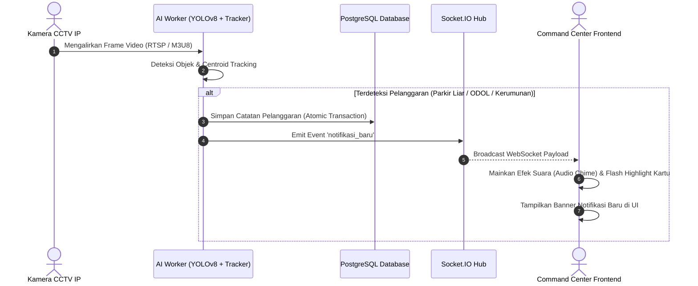
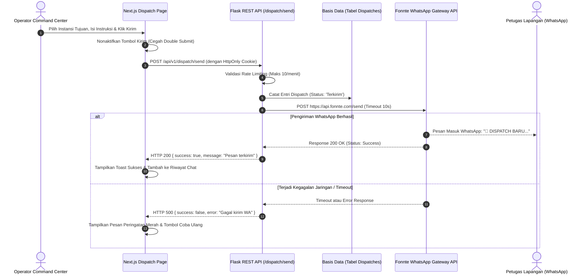

# PRODUCT REQUIREMENT DOCUMENT (PRD)
## DaashTics - Intelligent Traffic Analytics System Kota Bogor

---

### 📑 Informasi Dokumen
| Atribut | Keterangan |
|---|---|
| **Nama Produk** | **DaashTics (Dashboard & Traffic Analytics System)** |
| **Versi Produk** | 1.0.0 (Enterprise Monorepo Edition) |
| **Status Dokumen** | Production Ready / Approved |
| **Penyusun** | Tim Engineering & Product Management DaashTics |
| **Target Pengguna** | Dinas Perhubungan (Dishub) Kota Bogor, Satlantas Polresta Bogor Kota, Command Center Pemkot Bogor, & Publik |
| **Tanggal Pembaruan** | September 2026 |

---

## 1. Ringkasan Eksekutif (Executive Summary)

**DaashTics** adalah sistem pemantauan dan analisis lalu lintas terpadu berbasis kecerdasan buatan (*Vision AI*) yang dirancang khusus untuk memodernisasi tata kelola transportasi perkotaan di Kota Bogor. 

Sistem ini menggabungkan:
1. **Engine Computer Vision Modular** berbasis YOLOv8, Centroid Tracking, Homografi Kecepatan, dan Optical Character Recognition (OCR) untuk deteksi kerumunan pejalan kaki, penertiban parkir liar, pelanggaran dimensi muatan (ODOL), serta pembacaan plat nomor otomatis (ANPR).
2. **Backend Headless REST API & WebSocket** berbasis Flask 3.1 yang dirancang dengan prinsip *Zero-Trust Security*, agregasi basis data tingkat enterprise (PostgreSQL), dan pengiriman notifikasi real-time via Socket.IO.
3. **Emergency Dispatch WhatsApp Service** terintegrasi dengan gateway Fonnte untuk mobilisasi cepat personel lapangan.
4. **Command Center & Portal Publik** modern berbasis Next.js 14 App Router, TypeScript, Tailwind CSS, dan visualisasi spasial interaktif Leaflet GIS.

---

## 2. Latar Belakang & Identifikasi Masalah

Kota Bogor menghadapi tantangan mobilitas perkotaan yang tinggi dengan dinamika volume kendaraan di koridor-koridor utama (seperti SSA/Sistem Satu Arah, Otista, Pajajaran, dan Baranangsiang). Beberapa kendala operasional yang dihadapi meliputi:

1. **Pengawasan Manual yang Tidak Skalabel**: Petugas di posko monitoring harus memantau puluhan layar CCTV secara visual tanpa bantuan otomatisasi peringatan dini.
2. **Keterlambatan Penanganan Insiden**: Informasi kejadian seperti kemacetan akibat parkir liar, antrean angkutan umum, atau truk muatan berlebih (*Over Dimension Over Load*) terlambat direspons oleh personel lapangan.
3. **Ketiadaan Data Terstruktur untuk Pengambilan Kebijakan**: Data volume kendaraan harian, proporsi moda (motor, mobil, bus, truk), dan pola arus puncak masih bersifat sporadis dan tidak tersimpan dalam format agregasi time-series.
4. **Keterbatasan Akses Informasi bagi Publik**: Masyarakat membutuhkan visibilitas terhadap kondisi kepadatan jalan dan titik sebaran CCTV untuk merencanakan perjalanan secara efisien.

---

## 3. Target Pengguna & Persona

| Persona | Peran & Tanggung Jawab | Kebutuhan Utama |
|---|---|---|
| **Operator Command Center** | Staf teknis Dishub / Command Center yang bertugas memantau operasional lalu lintas secara real-time. | Live stream berlatensi rendah, notifikasi pelanggaran otomatis dengan audio chime, konsol emergency dispatch WhatsApp instan, catatan SOP lapangan. |
| **Administrator Sistem** | Administrator TI pengelola infrastruktur perangkat lunak dan data master. | Manajemen inventaris CCTV (CRUD, impor/ekspor CSV/Excel), manajemen batas wilayah spasial Kota Bogor, tata kelola akun pengguna (RBAC), kontrol toggle notifikasi global. |
| **Pimpinan / Pengambil Kebijakan (Stakeholder)** | Kepala Dinas Perhubungan / Kepala Unit Lalu Lintas Kota Bogor. | Dashboard analitik kepadatan 24 jam, ringkasan komposisi moda transportasi harian, rekapitulasi data pelanggaran untuk evaluasi kebijakan lalu lintas. |
| **Masyarakat Umum (Publik)** | Pengendara dan warga Kota Bogor. | Portal web publik tanpa login yang menyajikan visualisasi sebaran CCTV interaktif pada peta GIS dan grafik tren kepadatan koridor jalan. |

---

## 4. Ruang Lingkup Produk (Product Scope)

### 4.1 In Scope
- **Vision AI Inference**: Klasifikasi 5 kelas COCO (mobil, motor, bus, truk, orang), estimasi kecepatan (km/jam), deteksi arah lajur (Jauh/Dekat) menggunakan garis virtual (*virtual tripwire*).
- **Deteksi Pelanggaran Khusus**:
  - Parkir Liar (*Stationary vehicle monitoring* dengan batas waktu tertentu).
  - Truk ODOL (*Bounding box aspect ratio & area anomaly analysis*).
  - Kerumunan Pejalan Kaki (*Graph adjacency clustering centroid person*).
  - ANPR (*Automatic Number Plate Recognition*) dengan EasyOCR & validasi Regex plat nomor Indonesia.
- **Konsol Dispatch Darurat**: Pengiriman instruksi WhatsApp langsung ke instansi (Dishub, Polresta, Damkar, Dinkes/RSUD, BPBD) menggunakan Fonnte API dengan timeout 10 detik.
- **Sistem Informasi Geografis (GIS)**: Rendering batas wilayah administratif (Kelurahan/Kecamatan Kota & Kabupaten Bogor) menggunakan GeoJSON dan penanda (*marker*) CCTV dengan pratinjau live stream.
- **Portal Kepadatan Publik**: Grafik Chart.js interaktif untuk volume 24 jam, persentase moda, serta tabel rekapitulasi per lokasi CCTV.
- **Keamanan Enterprise**: Zero-Trust JWT/Signed token dalam HttpOnly Cookie, sliding-window rate limiting, Edge Runtime Route Guard pada Next.js Middleware, sanitasi input, audit trail.

### 4.2 Out of Scope (Future Roadmap)
- Integrasi sistem tilang elektronik nasional (ETLE Korlantas Polri API).
- Pengendalian lampu lalu lintas adaptif otomatis (*Adaptive Traffic Control System / ATCS hardware controller*).
- Aplikasi mobile native (iOS / Android) — saat ini dioptimalkan melalui Progressive Responsive Web App.

---

## 5. Arsitektur Sistem & Spesifikasi Teknologi

### 5.1 Diagram Arsitektur Monorepo
```text
                       [ KLIEN PENGGUNA ]
                ┌───────────────┴───────────────┐
                ▼                               ▼
       [ Portal Publik ]             [ Command Center Admin ]
       (Next.js 14 App Router)       (Next.js 14 App Router)
       - Leaflet Map (SSR: false)    - Live Stream Player (MJPEG)
       - Chart.js 24H Analytics      - Real-time Notifications (Socket.IO)
       - Tabel Rekapitulasi          - Dispatch WhatsApp Console
                │                               │
                └───────────────┬───────────────┘
                                │ HTTP / Cookie HttpOnly / WebSocket
                                ▼
                   [ EDGE RUNTIME MIDDLEWARE ]
                   (Verifikasi Token & Route Guard)
                                │
                                ▼
                   [ FLASK HEADLESS BACKEND ]
                         Port :5000
    ┌───────────────────────────┼───────────────────────────┐
    │                           │                           │
    ▼                           ▼                           ▼
[ REST API v1 ]        [ Socket.IO Engine ]        [ AI Vision Engine ]
- /auth/* (RBAC)       - Event: notifikasi_baru    - ThreadPool Detector
- /cctv/* (CRUD)       - Event: status_update      - ThreadPool OCR
- /monitoring/*                                    - OpenCV Frame Renderer
- /dispatch/*                                      - Euclidean Tracker
- /gis/*                                           - RTSP/M3U8 Streamer
- /kepadatan/*                  │                           │
    │                           │                           │
    └───────────────────────────┼───────────────────────────┘
                                ▼
                    [ BASIS DATA POSTGRESQL ]
                    - Tabel CCTV & User
                    - Tabel Time-Series Counting (Indexed)
                    - Tabel Pelanggaran (Parkir, ODOL, Kerumunan)
                    - Tabel GIS Batas Wilayah (GeoJSON/WKT)
```

### 5.2 Spesifikasi Teknologi (Tech Stack)

#### A. Backend & AI Engine
- **Bahasa**: Python 3.11
- **Framework API**: Flask 3.1.0, Flask-SQLAlchemy 3.1.1, Flask-Cors 6.0.1
- **Protokol Real-time**: Flask-SocketIO 5.5.1 (Eventlet / Gevent ready)
- **Computer Vision & AI**:
  - `ultralytics==8.3.119` (YOLOv8n untuk kendaraan/manusia, YOLO kustom `best.pt` untuk plat nomor)
  - `opencv-python==4.11.0.86` (Streaming capture, drawing annotasi visual, Otsu thresholding)
  - `easyocr==1.7.2` (Optical Character Recognition untuk alfanumerik plat nomor)
  - `shapely==2.1.2` (Parsing WKT ke GeoJSON batas wilayah)
  - `pandas==2.2.3` & `openpyxl==3.1.5` (Impor/ekspor data CCTV CSV/Excel)
- **Otentikasi & Keamanan**: ItsDangerous (Token cryptography), Werkzeug (Password hashing)

#### B. Frontend Client
- **Framework**: Next.js 14.2.5 (App Router, Server & Client Components)
- **Bahasa**: TypeScript 5.5.4
- **UI & Styling**: Tailwind CSS 3.4.7, Lucide React Icons, Clsx, Tailwind-Merge
- **Visualisasi Data**: Chart.js 4.4.3 & React-Chartjs-2 5.2.0
- **Pemetaan Geospasial**: Leaflet 1.9.4 & @types/leaflet (Pemuatan dinamis tanpa error SSR)
- **Real-time Client**: Socket.io-client 4.7.5

#### C. Database & Infrastruktur
- **RDBMS**: PostgreSQL 16 Alpine
- **Containerization**: Docker & Docker Compose (Multi-stage build)

---

## 6. Kebutuhan Fungsional (Functional Requirements)

### Modul 1: Otentikasi, Otorisasi (RBAC) & Keamanan Zero-Trust
| ID | Kebutuhan Fungsional | Deskripsi | Aktor |
|---|---|---|---|
| **FR-AUTH-01** | Form Login Petugas | Mengotentikasi pengguna menggunakan kredensial (username/email dan password). | Semua Pengguna |
| **FR-AUTH-02** | Keamanan Token & Cookie | Menerbitkan token bertanda tangan kriptografis dengan masa berlaku 24 jam yang disimpan pada `HttpOnly; SameSite=Lax` cookie. | Sistem |
| **FR-AUTH-03** | Edge Route Protection | Middleware Next.js memblokir akses ke rute `/admin/*` tanpa cookie `access_token` valid dan mengarahkan ke `/login`. | Middleware |
| **FR-AUTH-04** | Role-Based Access Control | Pembagian peran: `admin` memiliki akses penuh termasuk manajemen akun dan penghapusan data; `operator` memiliki akses monitoring dan dispatch. | Admin / Operator |
| **FR-AUTH-05** | Sliding Window Rate Limit | Membatasi percobaan login maksimal 5 kali per menit per IP untuk mencegah brute-force. | Sistem |
| **FR-AUTH-06** | Profil Pengguna | Memungkinkan pengguna memperbarui username, email, dan password lama/baru. | Pengguna Terotentikasi |

### Modul 2: Engine AI Computer Vision & Pemrosesan Video
| ID | Kebutuhan Fungsional | Deskripsi | Aktor |
|---|---|---|---|
| **FR-AI-01** | Multi-Source Stream Ingestion | Mendukung input video lokal (.mp4), live RTSP kamera IP, dan format streaming HLS (.m3u8). | Sistem AI |
| **FR-AI-02** | Klasifikasi Objek Lalu Lintas | Mengklasifikasikan mobil (*car*), sepeda motor (*motorcycle*), bus (*bus*), truk (*truck*), dan pejalan kaki (*person*). | Sistem AI |
| **FR-AI-03** | Penghitungan Arah (Tripwire) | Dua garis virtual (Line 1 & Line 2) mendeteksi kendaraan melintas ke arah JAUH (menjauh) atau DEKAT (mendekat). | Sistem AI |
| **FR-AI-04** | Estimasi Kecepatan Kendaraan | Menghitung kecepatan kendaraan (km/jam) berdasarkan kalibrasi homografi jarak riil antar garis. | Sistem AI |
| **FR-AI-05** | Deteksi Parkir Liar | Menandai kendaraan yang berhenti diam (*stationary*) di area pemantauan melebihi ambang batas durasi toleransi. | Sistem AI |
| **FR-AI-06** | Deteksi Truk ODOL | Menghitung rasio dimensi dan luas *bounding box* truk untuk mengidentifikasi truk bermuatan berlebih secara anomali. | Sistem AI |
| **FR-AI-07** | Deteksi Kerumunan | Menggunakan graf ketetanggaan (*adjacency matrix*) jarak Euclidean antar pejalan kaki untuk mendeteksi kerumunan orang. | Sistem AI |
| **FR-AI-08** | ANPR & OCR Plat Nomor | Melakukan *crop* kendaraan, deteksi bounding box plat dengan model YOLO `best.pt`, binarisasi Otsu, dan ekstraksi karakter via EasyOCR. | Sistem AI |
| **FR-AI-09** | Decoupled Thread Architecture | Eksekutor inferensi YOLO dan OCR berjalan asinkron di *thread pool* terpisah agar rendering stream 25 FPS tidak *blocking*. | Sistem AI |

### Modul 3: Command Center & Monitoring Real-Time
| ID | Kebutuhan Fungsional | Deskripsi | Aktor |
|---|---|---|---|
| **FR-MON-01** | Multi-Kamera Live Feed | Menampilkan pemutar video MJPEG dari kamera aktif yang dipilih pengguna. | Operator / Admin |
| **FR-MON-02** | Statistik Kartu Metrik | Menampilkan angka akumulasi insiden kerumunan, parkir liar, dan ODOL secara *live* dengan efek visual *flashing highlight*. | Operator / Admin |
| **FR-MON-03** | Log Notifikasi Terkini | Menampilkan riwayat kartu notifikasi masuk melalui WebSocket Socket.IO secara langsung tanpa me-refresh browser. | Operator / Admin |
| **FR-MON-04** | Global Notification Toggle | Fitur sakelar (*switch toggle*) untuk mengaktifkan atau membisukan seluruh pemberitahuan notifikasi sistem secara global. | Operator / Admin |
| **FR-MON-05** | Filter Mode Deteksi Stream | Opsi parameter stream: mode `simple` (bounding box biasa), `parking` (fokus parkir), dan `plate` (fokus plat nomor). | Operator / Admin |

### Modul 4: Manajemen Perangkat CCTV
| ID | Kebutuhan Fungsional | Deskripsi | Aktor |
|---|---|---|---|
| **FR-CCTV-01** | Katalog Kamera CCTV | Menampilkan daftar seluruh kamera dengan kolom nama lokasi, status (Aktif/Nonaktif), koordinat lat/long, dan tipe stream. | Admin |
| **FR-CCTV-02** | Pencarian & Filter Status | Pencarian nama lokasi ter-debounce serta filter status kamera (Semua, Aktif, Nonaktif). | Admin |
| **FR-CCTV-03** | Operasi CRUD Kamera | Tambah kamera baru, edit parameter kamera, dan soft-delete data kamera. | Admin |
| **FR-CCTV-04** | Impor Tabular 2 Langkah | Mengunggah berkas CSV/Excel, memvalidasi kolom pada modal *preview*, lalu menyimpan (*commit*) secara massal ke basis data. | Admin |
| **FR-CCTV-05** | Ekspor Tabular & Unduh Templat | Mengunduh daftar inventaris kamera ke format CSV atau Excel (.xlsx), serta menyediakan templat resmi impor data. | Admin |
| **FR-CCTV-06** | Pembaruan Otomatis Worker | Setiap penambahan atau pembaruan kamera memicu modul `workers_manager.py` memuat ulang thread kamera secara otomatis. | Sistem |

### Modul 5: Emergency Dispatch & Integrasi WhatsApp
| ID | Kebutuhan Fungsional | Deskripsi | Aktor |
|---|---|---|---|
| **FR-DISP-01** | Direktori Kontak Instansi | Menyimpan kontak telepon darurat instansi terkait (Dishub, Satlantas, Damkar, Dinkes, BPBD). | Admin / Operator |
| **FR-DISP-02** | Pengiriman Instruksi WhatsApp | Mengirim pesan instruksi taktis lapangan langsung ke WhatsApp PIC instansi via Fonnte Gateway. | Operator / Admin |
| **FR-DISP-03** | Proteksi Anti-Spam Dispatch | Pembatasan kuota kirim pesan maksimal 10 kali per menit per user untuk mencegah pemblokiran nomor oleh WhatsApp. | Sistem |
| **FR-DISP-04** | Riwayat & Audit Trail Dispatch | Mencatat setiap pesan keluar lengkap dengan identitas operator pengirim, waktu kirim, status pesan, dan tipe kejadian. | Operator / Admin |
| **FR-DISP-05** | Konsol Catatan & SOP Lapangan | Modul *scratchpad* catatan taktis yang tersimpan di *LocalStorage* browser dengan dukungan fitur penyematan (*pin note*). | Operator / Admin |

### Modul 6: Portal Publik Analisis Kepadatan Lalu Lintas
| ID | Kebutuhan Fungsional | Deskripsi | Aktor |
|---|---|---|---|
| **FR-KEP-01** | Metrik Volume Kendaraan | Menampilkan total volume kendaraan harian beserta rincian jumlah motor, mobil, bus, dan truk. | Publik / Tamu |
| **FR-KEP-02** | Proporsi Moda Transportasi | Menampilkan persentase pembagian kendaraan melalui diagram lingkaran atau batang. | Publik / Tamu |
| **FR-KEP-03** | Grafik Fluktuasi 24 Jam | Visualisasi grafik garis (*Chart.js*) yang menunjukkan dinamika lonjakan volume lalu lintas per jam (00:00 - 23:00). | Publik / Tamu |
| **FR-KEP-04** | Volume Berdasarkan Lajur | Pemisahan volume kendaraan yang bergerak mendekat (*counts dekat*) versus menjauh (*counts jauh*). | Publik / Tamu |
| **FR-KEP-05** | Tabel Rekapitulasi per CCTV | Menampilkan tabel agregasi volume kendaraan di seluruh titik CCTV Kota Bogor dengan efisiensi query SQL murni. | Publik / Tamu |

### Modul 7: Sistem Informasi Geografis (GIS) & Batas Spasial
| ID | Kebutuhan Fungsional | Deskripsi | Aktor |
|---|---|---|---|
| **FR-GIS-01** | Peta Spasial Interaktif | Menampilkan peta Kota Bogor (Leaflet OpenStreetMap) dengan koordinat default pusat kota (-6.5971, 106.8060). | Publik / Admin |
| **FR-GIS-02** | Poligon Batas Wilayah | Me-render lapisan batas administratif kecamatan/kelurahan Kota dan Kabupaten Bogor berdasarkan format GeoJSON. | Publik / Admin |
| **FR-GIS-03** | Marker Sebaran CCTV | Menampilkan pin lokasi CCTV dengan indikator warna status aktif/nonaktif dan modal pratinjau live video. | Publik / Admin |
| **FR-GIS-04** | Impor WKT Batas Wilayah | Mengunggah CSV berisi geometri WKT (*Well-Known Text*) dan mengonversinya secara otomatis ke format GeoJSON via Shapely. | Admin |
| **FR-GIS-05** | Manajemen Batas Wilayah | Menampilkan daftar batas wilayah, menghapus satu per satu, atau menghapus seluruh batas berdasarkan kategori. | Admin |

---

## 7. Kebutuhan Non-Fungsional (Non-Functional Requirements)

### 7.1 Keamanan Sistem (Security - Zero-Trust)
1. **Otentikasi & Penyimpanan Token**: Kredensial tidak pernah disimpan di `localStorage` peramban untuk mencegah kerentanan XSS. Token JWT/signed disimpan dalam cookie `HttpOnly; SameSite=Lax; Secure`.
2. **Proteksi Injeksi**: Seluruh manipulasi basis data wajib menggunakan ORM SQLAlchemy atau parameterized query. Tidak ada penggabungan string mentah (*string concatenation*).
3. **Pencegahan Brute-Force & Denial-of-Service**: Implementasi algoritma *Sliding Window* pada endpoint kritis:
   - `/api/v1/auth/login`: Maksimal 5 permintaan / menit / IP.
   - `/api/v1/dispatch/send`: Maksimal 10 permintaan / menit / User.
4. **Validasi Skema Input**: Setiap muatan JSON diverifikasi sebelum dieksekusi oleh service layer.
5. **Enkripsi Kata Sandi**: Menggunakan algoritma hash Werkzeug terstandarisasi industri (*PBKDF2/SHA256* dengan *salt* unik).

### 7.2 Performa & Kecepatan Respons (Performance & Latency)
1. **Integritas Agregasi SQL (Zero N+1 Problem)**:
   - Penggunaan eager loading `joinedload()` pada relasi entitas.
   - Perhitungan volume harian dan grafik 24 jam menggunakan fungsi agregasi murni PostgreSQL (`SUM`, `EXTRACT(hour)`, `GROUP BY`), bukan kalkulasi iteratif di memori Python.
2. **Pengindeksan Basis Data (Composite Time-Series Index)**:
   - Seluruh tabel transaksi berbobot tinggi (`counting_data`, `parking_violations`, `crowd_detections`, `odol_detections`) memiliki composite index pada pasangan kolom `(cctv_id, timestamp)`.
3. **Throughput Video AI**:
   - Inferensi YOLO berjalan pada resolusi yang dioptimalkan (`imgsz=480`) untuk latensi CPU < 80ms per frame.
   - Tugas berat OCR dijalankan dalam satu *worker pool* terisolasi (`OCR_EXECUTOR`) agar tidak terjadi *CPU starvation*.
4. **Batas Waktu Jaringan (HTTP Outbound Timeout)**:
   - Seluruh panggilan API eksternal (termasuk WhatsApp Fonnte) wajib menyertakan batas waktu `timeout=10` detik agar thread tidak terkatung-katung (*thread hanging*).

### 7.3 Ketersediaan & Keandalan (Reliability & Resilience)
1. **Idempotensi & Proteksi Pengiriman Ganda**: Tombol kirim dispatch dan tombol submit form dinonaktifkan seketika (*disabled*) begitu aksi diklik hingga proses respons server selesai.
2. **Transaksi Atomik (ACID)**: Seluruh operasi modifikasi database multi-langkah diapit blok `try ... db.session.commit() except ... db.session.rollback()`.
3. **Penyimpanan Riwayat Aman (Soft Deletes)**: Data master CCTV dilindungi dengan flag `is_deleted` dan `deleted_at`, mencegah terhapusnya riwayat tilang dan data penghitungan historis secara tidak sengaja.

### 7.4 Standar Tampilan Antarmuka & UX (User Experience)
1. **The 4 UI States**: Setiap komponen asynchronous diwajibkan menangani 4 status:
   - `Loading`: Menampilkan skeleton loader bernuansa gelap yang presisi.
   - `Success`: Menampilkan komponen data visual.
   - `Empty`: Menampilkan ilustrasi dan teks kontekstual yang informatif jika data kosong.
   - `Error`: Menampilkan pesan kesalahan ramah pengguna disertai tombol coba lagi (*retry*).
2. **Desain Visual Kelas Premium**: Nuansa modern *Dark Mode Glassmorphism* (latar `#0b0f19` hingga `#0f172a`), palet warna terkurasi (Emerald, Indigo, Rose, Amber), dan tipografi bersih berbasis standar web modern.
3. **Kompatibilitas SSR**: Komponen Leaflet Map dimuat secara asinkron menggunakan `next/dynamic` dengan opsi `ssr: false` untuk mengeliminasi konflik objek `window` di lingkungan Node.js server.

---

## 8. Model Data & Skema Basis Data

### 8.1 Skema Relasi Entitas (ERD)

```text
       ┌────────────────────────┐
       │         USERS          │
       ├────────────────────────┤
       │ PK  id (BigInt)        │
       │     username (String)  │
       │     email (String)     │
       │     password_hash      │
       │     role (String)      │
       └───────────┬────────────┘
                   │ 1
                   │
                   │ N
       ┌───────────▼────────────┐            ┌────────────────────────┐
       │       DISPATCHES       │            │         KONTAK         │
       ├────────────────────────┤            ├────────────────────────┤
       │ PK  id (BigInt)        │       N    │ PK  id (BigInt)        │
       │ FK  user_id (BigInt)   ├───────────►│     instansi (String)  │
       │ FK  kontak_id (BigInt) │            │     nomor_telp (String)│
       │     tipe_dispatch      │            └────────────────────────┘
       │     instruksi (Text)   │
       │     waktu_kirim        │
       │     status (String)    │
       └────────────────────────┘

       ┌────────────────────────┐
       │          CCTV          │
       ├────────────────────────┤
       │ PK  id (BigInt)        │
       │     lokasi (String)    │
       │     status (String)    │
       │     latitude (Float)   │
       │     longitude (Float)  │
       │     stream_url (String)│
       │     is_deleted (Bool)  │
       │     created_at / updated│
       └───────────┬────────────┘
                   │
         ┌─────────┼─────────────────────────┬─────────────────────────┐
         │ 1       │ 1                       │ 1                       │ 1
         │         │                         │                         │
         │ N       │ N                       │ N                       │ N
┌────────▼──────┐ ┌▼──────────────────┐ ┌────▼─────────────────┐ ┌─────▼────────────────┐
│ COUNTING_DATA │ │PARKING_VIOLATIONS │ │   CROWD_DETECTIONS   │ │   ODOL_DETECTIONS    │
├───────────────┤ ├───────────────────┤ ├──────────────────────┤ ├──────────────────────┤
│ PK id         │ │ PK id             │ │ PK id                │ │ PK id                │
│ FK cctv_id    │ │ FK cctv_id        │ │ FK cctv_id           │ │ FK cctv_id           │
│    timestamp  │ │    timestamp      │ │    timestamp         │ │    timestamp         │
│ counts_jauh_* │ │    vehicle_type   │ │    crowd_size        │ │    vehicle_type      │
│ counts_dekat_*│ │parked_duration_sec│ │    duration_sec      │ │    aspect_ratio      │
│ grand_total   │ │    object_id      │ └──────────────────────┘ │    area              │
└───────────────┘ └───────────────────┘                          └──────────────────────┘
 [Index: cctv_id, [Index: cctv_id,       [Index: cctv_id,         [Index: cctv_id,
     timestamp]       timestamp]             timestamp]               timestamp]
```

### 8.2 Entitas Batas Wilayah (GIS)
| Kolom | Tipe Data | Keterangan |
|---|---|---|
| `id` | BigInteger (PK) | Pengidentifikasi unik batas wilayah |
| `nama` | String(255) | Nama kelurahan/kecamatan/wilayah administratif |
| `jenis` | String(50) (Indexed) | Kategori: `Kota` atau `Kabupaten` |
| `geojson` | Text | Representasi poligon spasial dalam format string GeoJSON |
| `keterangan` | String(500) | Deskripsi tambahan atau tipe zonasi |

---

## 9. Kontrak API (API Contract Specification)

Seluruh endpoint REST API mematuhi standar JSON Contract terstruktur:

**Format Respons Berhasil**:
```json
{
  "success": true,
  "data": { ... },
  "message": "Pesan status operasional.",
  "meta": { "total": 10 }
}
```

**Format Respons Kesalahan**:
```json
{
  "success": false,
  "error": {
    "code": "ERROR_CODE",
    "message": "Deskripsi kesalahan yang mudah dipahami manusia."
  }
}
```

### 9.1 Daftar Endpoint REST API v1

| Modul | Method | Endpoint | Hak Akses | Deskripsi |
|---|---|---|---|---|
| **Auth** | `POST` | `/api/v1/auth/login` | Publik (Rate-limited) | Verifikasi kredensial & set cookie `access_token` |
| | `GET` | `/api/v1/auth/me` | Operator / Admin | Mengambil profil user yang sedang login |
| | `POST` | `/api/v1/auth/logout` | Terotentikasi | Menghapus sesi dan mencabut cookie |
| | `GET` | `/api/v1/auth/users` | Admin | Mengambil daftar seluruh pengguna |
| | `POST` | `/api/v1/auth/users` | Admin | Menambah pengguna baru |
| | `DELETE`| `/api/v1/auth/users/<id>` | Admin | Menghapus akun pengguna tertentu |
| | `PUT` | `/api/v1/auth/profile` | Terotentikasi | Memperbarui username, email, atau password |
| **CCTV** | `GET` | `/api/v1/cctv` | Publik / Internal | Mengambil daftar CCTV (pencarian & filter status) |
| | `GET` | `/api/v1/cctv/summary` | Publik / Internal | Ringkasan metrik total, aktif, nonaktif, terhapus |
| | `POST` | `/api/v1/cctv` | Admin | Mendaftarkan kamera CCTV baru |
| | `GET` | `/api/v1/cctv/<id>` | Publik / Internal | Detail data satu CCTV |
| | `PUT` | `/api/v1/cctv/<id>` | Admin | Memperbarui parameter CCTV |
| | `DELETE`| `/api/v1/cctv/<id>` | Admin | Soft delete data CCTV |
| | `POST` | `/api/v1/cctv/<id>/restore` | Admin | Memulihkan CCTV yang berstatus terhapus |
| | `POST` | `/api/v1/cctv/import/preview` | Admin | Menelaah isi berkas CSV/Excel sebelum disimpan |
| | `POST` | `/api/v1/cctv/import/commit` | Admin | Menyimpan baris data CCTV hasil telaah |
| | `GET` | `/api/v1/cctv/export/csv` | Admin | Mengunduh berkas CSV daftar CCTV |
| | `GET` | `/api/v1/cctv/export/excel` | Admin | Mengunduh berkas Excel daftar CCTV |
| | `GET` | `/api/v1/cctv/template` | Admin | Mengunduh templat resmi berkas impor CCTV |
| | `POST` | `/api/v1/cctv/bulk-delete` | Admin | Menghapus beberapa kamera sekaligus |
| **Monitoring** | `GET` | `/api/v1/monitoring/cameras` | Publik / Internal | Daftar kamera aktif dengan stream URL |
| | `GET` | `/api/v1/monitoring/stats/<cam_id>` | Publik / Internal | Statistik real-time kerumunan dan kendaraan kamera |
| | `GET` | `/api/v1/monitoring/violations` | Publik / Internal | Riwayat 20 pelanggaran parkir & ODOL terkini |
| | `GET` | `/api/v1/monitoring/stream/<cam_id>` | Publik / Internal | Multipart MJPEG stream video beranotasi AI |
| | `GET` | `/api/v1/monitoring/notifications/status` | Terotentikasi | Cek status sakelar notifikasi global |
| | `POST` | `/api/v1/monitoring/notifications/toggle` | Terotentikasi | Mengubah status aktif/nonaktif notifikasi global |
| **Kepadatan** | `GET` | `/api/v1/kepadatan/metrics` | Publik | Metrik volume total, 24H, arah lajur, & rekapitulasi |
| | `GET` | `/api/v1/kepadatan/live/<cctv_id>` | Publik | Data hitungan instan dari memori worker AI |
| **GIS** | `GET` | `/api/v1/gis/map_data` | Publik | Poligon GeoJSON batas wilayah & marker CCTV |
| | `GET` | `/api/v1/gis/boundaries` | Publik | Daftar tabular entri batas administratif |
| | `DELETE`| `/api/v1/gis/boundaries/<id>` | Admin | Menghapus satu data batas wilayah |
| | `POST` | `/api/v1/gis/boundaries/import/<tipe>` | Admin / Operator | Mengunggah CSV WKT batas wilayah |
| | `POST` | `/api/v1/gis/boundaries/delete-all/<tipe>` | Admin | Menghapus seluruh batas Kota atau Kabupaten |
| **Dispatch** | `GET` | `/api/v1/dispatch/contacts` | Publik / Internal | Daftar kontak darurat instansi terkait |
| | `POST` | `/api/v1/dispatch/contacts` | Admin | Menambah kontak instansi baru |
| | `GET` | `/api/v1/dispatch/history` | Operator / Admin | Riwayat pengiriman pesan emergency dispatch |
| | `POST` | `/api/v1/dispatch/send` | Operator / Admin (Rate-limited) | Mengirim instruksi dispatch via WhatsApp Fonnte |
| | `DELETE`| `/api/v1/dispatch/history/<id>` | Admin | Menghapus riwayat catatan dispatch |

### 9.2 Event WebSocket (Socket.IO)

| Nama Event | Arah | Payload Utama | Deskripsi |
|---|---|---|---|
| `notifikasi_baru` | Server ➔ Klien | `{ title, detail, type, camera_id, location, timestamp }` | Dikirimkan seketika saat AI mendeteksi pelanggaran parkir, kerumunan, atau ODOL. |
| `notification_status_update` | Server ➔ Klien | `{ enabled: boolean }` | Pemberitahuan saat sakelar notifikasi diubah oleh salah satu operator. |

---

## 10. Alur Kerja Sistem (Sequence & User Flows)

### 10.1 Alur Deteksi Pelanggaran & Broadcast Notifikasi Real-Time


### 10.2 Alur Pengiriman Emergency Dispatch via WhatsApp


---

## 11. Strategi Pengujian & Verifikasi Kualitas

Sistem DaashTics dilengkapi dengan test runner terotomasi berbasis `unittest` Python yang memvalidasi seluruh kontrak API dan aspek keamanan sebelum rilis ke tahap produksi:

```bash
python -m unittest discover -t backend -s backend/tests -p "test_*.py" -v
```

### Matriks Pengujian Terotomasi (Automated Test Suite)
| Nama Unit Test | Kategori | Skenario yang Diuji | Status |
|---|---|---|---|
| `test_healthcheck_root` | System | Menjamin backend berjalan dan merespons `200 OK` pada root endpoint. | PASS |
| `test_login_validation_missing_credentials` | Security | Menguji penolakan muatan kosong dengan status `400 Bad Request`. | PASS |
| `test_login_invalid_credentials` | Security | Menolak password salah dengan pesan `INVALID_CREDENTIALS` (`401`). | PASS |
| `test_invalid_token_returns_401` | Security | Menolak token JWT yang rusak atau kedaluwarsa saat mengakses endpoint terproteksi. | PASS |
| `test_unauthenticated_me_returns_401` | RBAC | Mencegah akses ke profil `/auth/me` tanpa login. | PASS |
| `test_unauthenticated_dispatch_history_returns_401` | RBAC | Menolak pembacaan riwayat dispatch tanpa otentikasi. | PASS |
| `test_unauthenticated_gis_delete_returns_401` | RBAC | Menolak penghapusan data batas spasial tanpa hak akses admin. | PASS |
| `test_get_cctv_list` | REST API | Memastikan format data daftar CCTV sesuai dengan schema JSON kontrak. | PASS |
| `test_get_cctv_summary` | Database | Memverifikasi ketepatan angka ringkasan kamera aktif/nonaktif. | PASS |
| `test_get_monitoring_cameras` | Engine | Memastikan hanya CCTV berstatus aktif dengan stream URL yang disajikan ke monitor. | PASS |
| `test_get_monitoring_violations` | Database | Menguji query eager loading joined table pada pelanggaran terkini. | PASS |
| `test_get_kepadatan_metrics` | SQL Integrity | Menjamin agregasi `SUM` dan `GROUP BY hour` berjalan murni di database tanpa error N+1. | PASS |
| `test_get_gis_map_data` | Spasial | Memastikan geometri GeoJSON dan koordinat marker terbentuk sempurna untuk Leaflet. | PASS |
| `test_get_dispatch_contacts` | Service | Memastikan seluruh daftar instansi respon cepat termuat dengan benar. | PASS |

---

## 12. Panduan Penerapan & Operasional (Deployment Guide)

Sistem siap dijalankan melalui kontainer Docker multi-arsitektur:

```bash
# 1. Setup Variabel Lingkungan
cp .env.example .env

# 2. Eksekusi Orkestrasi Docker
docker compose up --build -d

# 3. Verifikasi Status Layanan
docker compose ps
```

**Port Layanan Terbuka**:
- Frontend Next.js: `http://localhost:3000`
- Backend Headless REST API: `http://localhost:5000`
- PostgreSQL Database Engine: `localhost:5432`

---

## 13. Metrik Keberhasilan Produk (Key Performance Indicators)

| Kategori KPI | Indikator Kunci | Target |
|---|---|---|
| **Akurasi AI** | Mean Average Precision (mAP) deteksi kendaraan | > 88% pada kondisi pencahayaan siang & sore |
| **Kecepatan Respons** | Rata-rata latensi respons REST API | < 120 ms untuk query analitik aggregasi SQL |
| **Efisiensi Dispatch** | Durasi pengiriman instruksi dari deteksi hingga terkirim ke WhatsApp instansi | < 5 detik |
| **Stabilitas Streaming** | Frame per second (FPS) render video stream | Stabil pada 20 - 25 FPS tanpa memory leak |
| **Ketersediaan Layanan** | Uptime sistem operasional Command Center | 99.5% operational availability |

---

*Dokumen ini merupakan spesifikasi resmi kebutuhan produk DaashTics dan wajib menjadi pedoman rujukan utama bagi pengembang, desainer, dan pemangku kepentingan dalam seluruh siklus pemeliharaan dan ekspansi fitur selanjutnya.*
